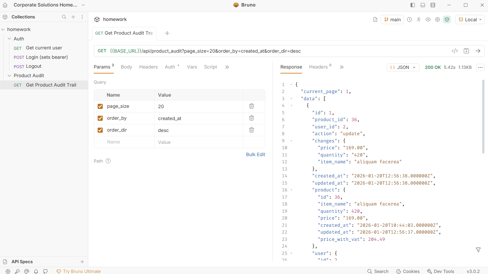

**NB:** If using WSL2, it's better to have this repository in the Linux filesystem. This cuts down response time from 5s to 1s.

# Setup steps:
1. After cloning repository, copy values from .env.example to .env;
2. Use docker compose: `docker-compose up -d` to start the services;
3. Generate keys `docker exec -it cs-app php artisan key:generate`;
4. Run migrations `docker exec -it cs-app php artisan migrate`;
5. Seed the database `docker exec -it cs-app php artisan db:seed`;
6. Install npm packages - `npm install`;
7. Run the dev server `npm run dev`, or muddle through unstyled html;
8. If you see a login page when opening http://localhost/, the server is working;
9. Run tests `docker exec -it cs-app php artisan test`

I prepared a workspace with the API testing tool UseBruno, you can use it to quickly test the API routes.

If you are not familiar with it, UseBruno is very similar to Postman, but entirely local and everything
is stored in files which means it can be commited to git.
All you need to do is install it, and open the .usebruno/corporate-solutions-homework workspace through it,
then you should see some requests I already made for testing.

If you have any questions, feel free to ask me, and thank you for considering me for this job. :)
